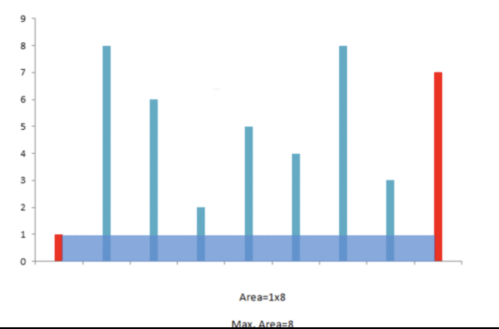

## Solution Explanation

### Algorithm

Intuition for solving this problem is following:

- the area formed between the lines will always be limited by the height of the shorter line.
-  the farther the lines, the more will be the area obtained. This is because
the width between two lines increases.

So, the algorithm is following:

We take two pointers, one at the beginning and 
one at the end of the array constituting the length of the lines. 
Further, we maintain a variable `maxArea` to store the maximum area obtained till now. 
At every step, we find out the area formed between them, update `maxArea` 
and move the pointer pointing to the shorter line towards the other end by one step.
The algorithm terminates when two pointers meet with each other.

### Understand Algorithm

Initially we consider the area constituting the exterior most lines. 
Now, to maximize the area, we need to consider the area between the lines of larger lengths. 
If we try to move the pointer at the longer line inwards, we won't gain any increase in area, 
since it is limited by the shorter line. But moving the shorter line's pointer could turn out to be beneficial, 
as per the same argument, despite the reduction in the width. This is done since a relatively longer line obtained 
by moving the shorter line's pointer might overcome the reduction in area caused by the width reduction.

Concretely, [this post](https://discuss.leetcode.com/topic/3462/yet-another-way-to-see-what-happens-in-the-o-n-algorithm)
gives a nice explanation of the correctness of algorithm. Essentially, we argue why we move the shorter line
instead of the longer one. The idea is based on the intuition (1): the area is limited by the shorter line.
We won't get any area gain by moving the longer line. 

Specifically, let's try to understand "Now if the left line is shorter than the right line, then all the elements left to 
`(1,6)` on the first row have smaller volume, so we don't need to compute those cases (crossed by `---`)". The
reason we don't need to compute all the elements left to `(1,6)` is that:

1) there are lines in-between 1 and 6 are greater than the line height at 1. Then, those areas
are equal to the area formed by `(1,6)`

2) there are lines in-between 1 and 6 are smaller than the line height at 1. Then, those areas
are smaller than the area formed by `(1,6)`. Since we try to find the max area, then it doesn't matter
to calculate those areas either.

## Reference

- https://leetcode.com/articles/container-most-water/
- https://discuss.leetcode.com/topic/3462/yet-another-way-to-see-what-happens-in-the-o-n-algorithm
- https://discuss.leetcode.com/topic/503/anyone-who-has-a-o-n-algorithm/3
