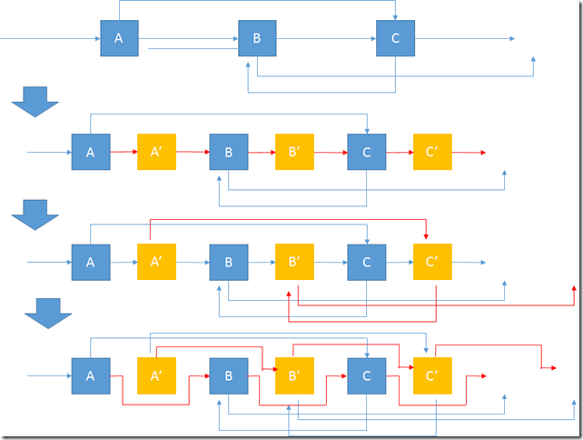

## Solution explanation

See [this page on deep copy vs. shallow copy](https://www.cs.utexas.edu/~scottm/cs307/handouts/deepCopying.htm).

### Solution 1: Use dictionary [Accepted]

这道链表的深度拷贝题的难点就在于如何处理随机指针的问题，由于每一个节点都有一个随机指针，这个指针可以为空，
也可以指向链表的任意一个节点，如果我们在每生成一个新节点给其随机指针赋值时，都要去遍历原链表的话，OJ上肯定会超时，
所以我们可以考虑用Hash map来缩短查找时间，第一遍遍历生成所有新节点时同时建立一个原节点和新节点的哈希表，
第二遍给随机指针赋值时，查找时间是常数级.

- Time complexity: $O(n)$
- Space complexity: we use $O(n)$ extra space to create the dictionary

The solution is implemented in `copyRandomList`.

### Solution 2: No dictionary [Accepted]

1. 在原链表的每个节点后面拷贝出一个新的节点
2. 依次给新的节点的随机指针赋值，而且这个赋值非常容易 `curr.next.random = curr.random.next`
3. 断开链表可得到深度拷贝后的新链表

The following picture illustrate the steps:

- Time complexity: $O(n)$
- Space complexity: $O(1)$ since there is no extra space used

## Reference

- http://www.cnblogs.com/grandyang/p/4261431.html
- http://fisherlei.blogspot.com/2013/11/leetcode-copy-list-with-random-pointer.html
- https://leetcode.com/problems/copy-list-with-random-pointer/discuss/43491/A-solution-with-constant-space-complexity-O(1)-and-linear-time-complexity-O(N)