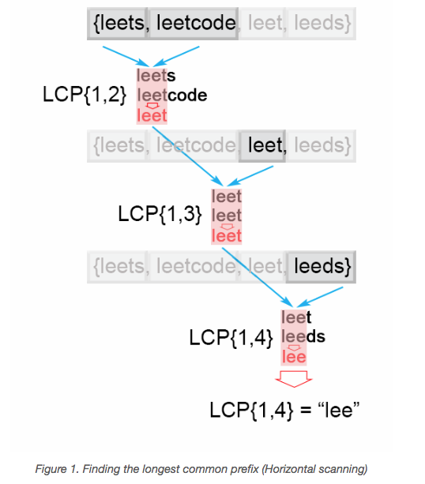
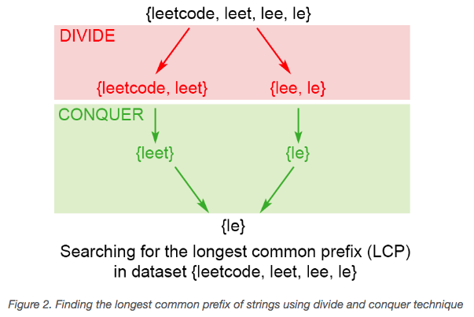
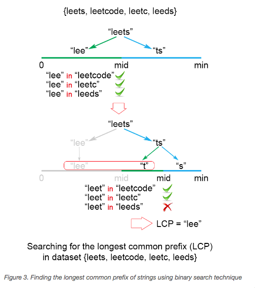
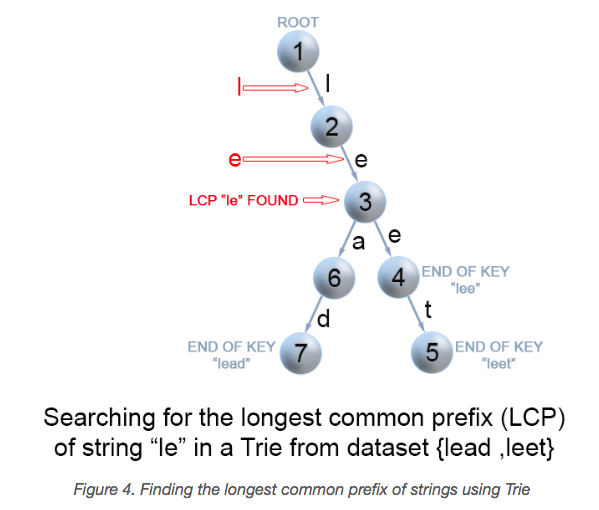

## Solution Explanation

In the following, we use $LCP(S_1, \dots, S_n)$ denotes operation of finding the longest prefix shared by a set of strings.

### Approach 1: Horizontal Scanning

The idea is following:

$$LCP(S_1, \dots, S_n) = LCP(LCP(LCP(S_1, S_2), S_3), \dots, S_n)$$

To employ this idea, the algorithm iterates through the strings $[S_1, \dots, S_n]$,
finding at each iteration $i$ the longest common prefix of strings $LCP(S_1 \ldots S_i)$.
When $LCP(S_1 \ldots S_i)$ is an empty string, the algorithm ends.
Otherwise after nn iterations, the algorithm returns $LCP(S_1 \ldots S_n)$.

- Time Complexity: $O(S)$, where $S$ is the sum of all characters in all strings.
In the worst case all $n$ strings are the same. The algorithm
compares the string $S_1$ with the other strings $[S_2 \ldots S_n]$
There are $S$ character comparisons, where $S$ is the sum of all characters in the input array.

- Space Complexity: $O(1)$. We only used constant extra space.

### Approach 2: Vertical scanning

Imagine a very short string is at the end of the array. T
he above approach will still do $S$ comparisons.
One way to optimize this case is to do vertical scanning.
We compare characters from top to bottom on the same column
(same character index of the strings) before moving on to the next column.

- Time complexity : $O(S)$ , where $S$ is the sum of all characters in all strings.
In the worst case there will be $n$ equal strings with length $m$ and the algorithm performs $S=m*n$ 

- Space complexity : $O(1)$. We only used constant extra space.

### Approach 3: Divide and Conquer

The idea of the algorithm comes from the associative property of
LCP operation. We notice that:
$LCP(S_1, \dots, S_n) = LCP(LCP(S_1, \dots, S_k), LCP(S_{k+1}, \dots, S_n))$

To apply the observation above, we use the divide and conquer technique, where we
split the $LCP(S_i, \dots, S_j)$ problem into two subproblems $LCP(S_i, \dots, S_mid)$
and $LCP(S_{mid+1}, \dots, S_j)$, where $mid = \frac{i+j}{2}$. We use their
solutions `lcpLeft` and `lcpRight` to construct the solutions of the main problem
$LCP(S_i, \dots, S_j)$. To accomplish this we compare one by one of the characters of
`lcpLeft` and `lcpRight` till there is no character match. The found common prefix of
`lcpLeft` and `lcpRight` is the solution of the $LCP(S_i, \dots, S_j)$.

- Time complexity: $O(S)$, where $S$ is the number of all characters in the array, $S=m*n$.
Time complexity is $2 \cdot T\left ( \frac{n}{2} \right ) + O(m)$.
Therefore time complexity is $O(S)$.
In the best case this algorithm performs $O(minLen \cdot n)$ comparisons,
where $minLen$ is the shortest string of the array.

- Space complexity : $O(m \cdot log(n))$. There is a memory overhead since we store recursive calls in the execution stack.
There are $log(n)$ recursive calls, each store need $m$ space to store the result, so space complexity is $O(m \cdot log(n))$.

### Approach 4: Binary search

The idea is to apply binary search method to find the right boundary of the longest string, which is common prefix of all of the strings
(i.e. the longest string [0, mid)). The algorithm searches space is the interval $[0 \ldots minLen)$, where $minLen$ is minimum string length
and the maximum index value of the possible common prefix. Each time search space is divided in two equal parts,
one of them is discarded, because it is sure that it doesn't contain the solution.
There are two possible cases:

- S[1...mid] is not a common string. This means that for each j > i, S[1..j] is not a common string and we discard the second half of the search space.
- S[1...mid] is common string. This means that for for each i < j, S[1..i] is a common string and we discard the first half of the search space,
because we try to find longer common prefix.

- Time complexity:  $O(S \cdot log(n))$, where $S$ is the sum of all characters in all strings. The algorithm makes $log(n)$ iterations,
for each of them there are $S = m*n$ comparisons, which gives in total $O(S \cdot log(n))$ time complexity.

- Space complexity : $O(1)$. We only used constant extra space.

## Approach 5: Use trie

The longest common prefix in trie has to satisfy two conditions:

- each node along the path must contain only one child element (Otherwise, the found path will not be a common prefix among all strings)
- the path doesn't comprise of nodes which are marked as end of key (Otherwise the path couldn't be a prefix a of key which is shorter than itself)

- Time complexity: $O(S+k)$. Insert all the string into trie takes $O(s)$. If the longest common prefix is $k$ chars, then
search for the prefix takes $O(k)$.

- Space complexity: $O(S)$. We use additional $S$ extra space for the trie.

## Reference

- https://leetcode.com/problems/longest-common-prefix/solution/
