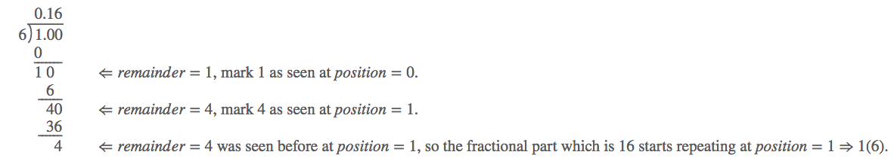

## Solution explanation

### Solution 1 Long Division [Accepted]

The key insight here is to notice that once the remainder starts repeating, so does the divided result.

You will need a hash table that maps from the remainder to its position of the fractional part. 
Once you found a repeating remainder, you may enclose the reoccurring fractional part with parentheses by 
consulting the position from the table.

### Solution 2

It turns out that mathematical solution actually exists for this problem. Check out 
the reference link from stackexchange below. 

## Reference

- https://leetcode.com/problems/fraction-to-recurring-decimal/solution/
- https://softwareengineering.stackexchange.com/questions/192070/what-is-a-efficient-way-to-find-repeating-decimal