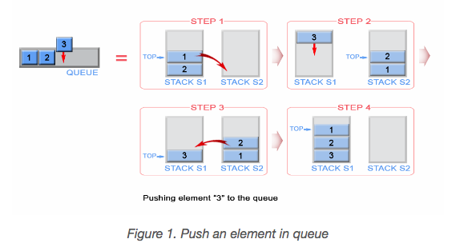
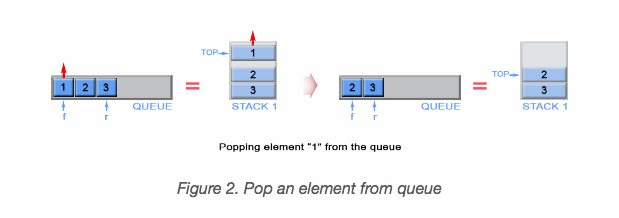
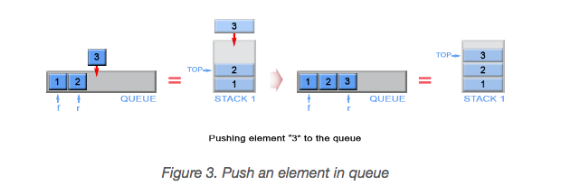
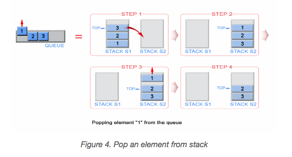

## Solution explanation

### Approach 1:

The push and pop demonstration are shown in the picture below:

**push**:

- Space complexity: $O(n)$
- Time complexity: $O(n)$ (Each element, with the exception of the newly arrived, is pushed and popped twice)

**pop, peak, empty**:

- Time complexity: $O(1)$

### Approach 2:

**push**:

The newly arrived element is always added on top of stack `s1` and the first element is kept as front queue element.

- Time complexity: $O(1)$
- Space complexity: $O(n)$

**pop**:

We have to remove element in front of the queue. This is the first inserted element in the stack `s1` and
it is positioned at the bottom of the stack because of stack's LIFO (last in - first out) policy.
To remove the bottom element from `s1`, we have to pop all elements from `s1` and to push them on to
an additional stack `s2`, which helps us to store the elements of `s1` in reversed order.
This way the bottom element of `s1` will be positioned on top of `s2` and we can simply pop it from stack `s2`.
Once `s2` is empty, the algorithm transfer data from `s1` to `s2` again.

- Time complexity: $O(n)$ worst case. $O(1)$ amortized.

Amortized analysis gives the average performance (over time) of each operation in the worst case.
The basic idea is that a worst case operation can alter the state in such a way that
the worst case cannot occur again for a long time, thus amortizing its cost.

Consider this example where we start with an empty queue with the following sequence of operations applied:

$$\text{push}_1, \text{push}_2, \dots, \text{push}_n, \text{pop}_1, \text{pop}_2, \dots, \text{pop}_n$$

The worst case time complexity of a single pop operation is $O(n)$. Since we have $n$ pop operations,
using the worst-case per operation analysis gives us a total of $O(n^2)$ time.

However, in a sequence of operations the worst case does not occur often in each operation -
some operations may be cheap, some may be expensive.
Therefore, a traditional worst-case per operation analysis can give overly pessimistic bound.
For example, in a dynamic array only some inserts take a linear time, though others - a constant time.

In the example above, the number of times pop operation can be called is limited by the number of push operations
before it. Although a single pop operation could be expensive, it is expensive only once per $n$ times (queue size),
when `s2` is empty and there is a need for data transfer between `s1` and `s2`.
Hence the total time complexity of the sequence is : $n$ (for push operations) + 2*n (for first pop operation) + $n - 1$ (for pop operations) which is $O(2*n)$. This gives $O(2n/2n) = O(1)$ average time per operation.

**peek, empty**

- Time complexity: $O(1)$

## Reference

- https://leetcode.com/problems/implement-queue-using-stacks/solution/
