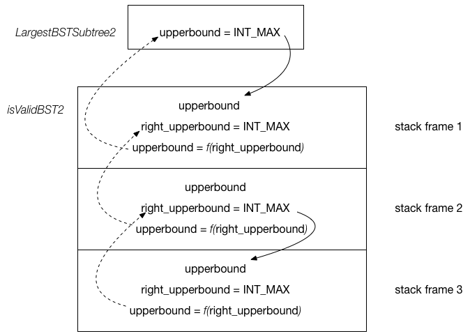

## Solution explanation

One common pitfall I fall in this problem is that why the given example returns 3 instead of 5, which
the subtree is:

```
     10
    / \
   5  15
  / \
 1   8
```

Here is the tricky part of the BST definition: to make the binary tree with root $X$ be BST, we require __every__
node in the BT with root $X$ satisfies the BST property: X->left->val < X->val < X->right->val. Clearly, this is not
the case here, as `7` in the original BT is smaller than `10`. Be very careful about BST definition!

### Approach 1: valid BST way

The first approach is to use [98. Valid BST](https://github.com/xxks-kkk/shuati/tree/master/leetcode/98-ValidateBinarySearchTree)
approach by recursively verifying every node in the given tree to see if it is a valid BST. If so, we return the size of it.
At last, we return the max size.

- Time complexity: $O(n)$

### Approach 2: $O(n)$ approach

The solution is straightforward in the sense that we still use the valid BST idea but this time, we count the size of
BST while we doing the the validation.

The tricky part is to understand how we update the variables in the call stack. I'm always afraid of creating any
temporary variables that passed in the following function call stack. Specifically, `left_upperbound`, `left_lowerbound`,
`right_upperbound`, `right_lowerbound` are temporary variables passed to `isValidBST` like
`isValidBST(root->left, left_upperbound, left_lowerbound, left_size)` and I thought those variables might screw
 the variables I actually care about `upperbound` and `lowerbound`. However, that's not true.
The relationship between these temporary variables with `upperbound` and `lowerbound` passed from previous
recursive function call is shown in the picture below:



"upperbound = f(right_upperbound)" represents `upperbound = (root->right) ? right_upperbound : root->val;`.

## Reference

- http://www.cnblogs.com/grandyang/p/5188938.html
- https://leetcode.com/problems/largest-bst-subtree/discuss/125509/Concise-C++-with-explanation-(-EASY-to-understand-)