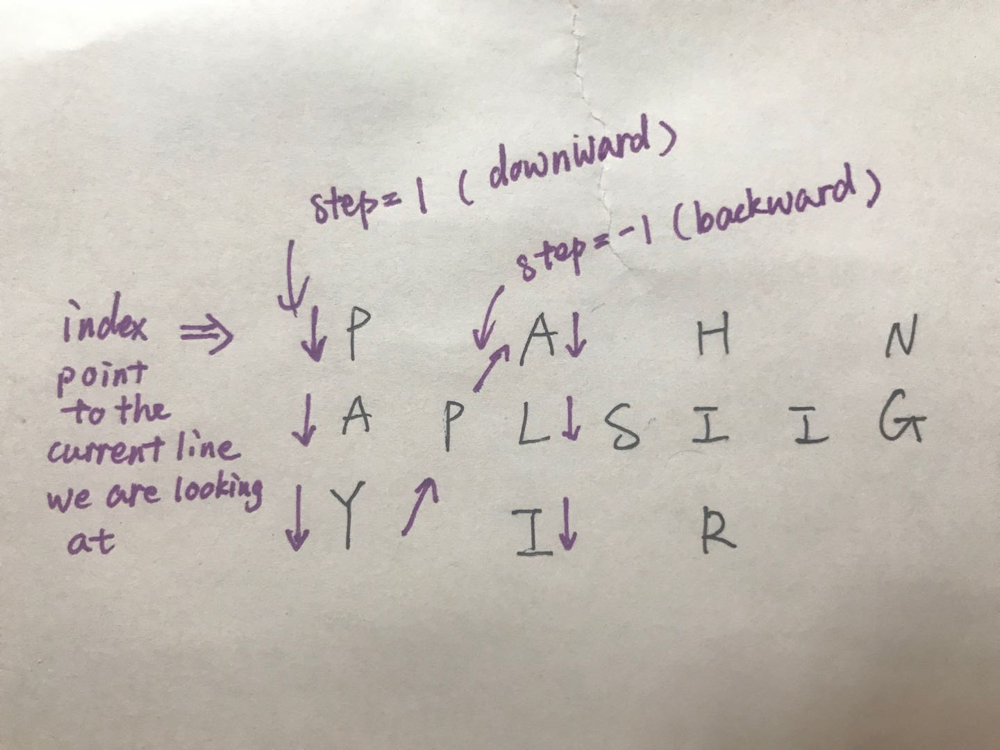

## Solution Explanation

To understand the solution, we can handtrace the program or debug through.
Here, we talk about the intuition. Let's use the example from the problem.
Suppose we have the string ``"PAYPALISHIRING"`` written in zigzag pattern
on a given number of rows like this:

```
P   A   H   N
A P L S I I G
Y   I   R
```

To understand the `step` variable in the solution. We can view the example
like this:



So, the whole algorithm is just follow the arrow direction and construct
our ``L`` before printing out.


## Reference

- https://discuss.leetcode.com/topic/34573/python-o-n-solution-in-96ms-99-43/3